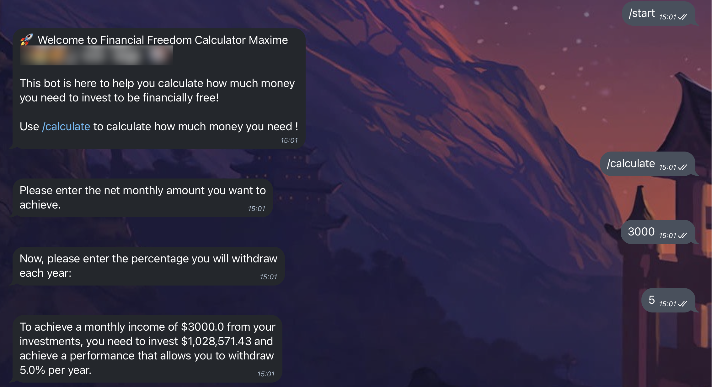

# Financial Independence Telegram Bot

## Project Overview

This project is a simple Telegram bot that allows users to calculate their investment portfolio amount that they will need to achieve their financial independence.

It is a simple interaction where the bot ask for the amount and for the witdhrawal % and calculates automatically the money amount.

The only country where it take into consideration specific taxes is France.

For all others countries, it will automatically calculate the taxation with 30%.

## To do later:

- [ ] Give the user the choice of the % taxation
